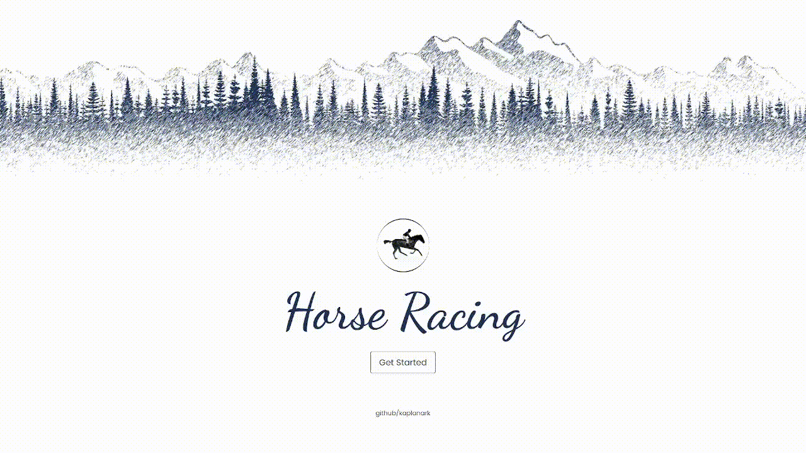

# Horse Race

Horse racing is a competition simulation in which eight horses compete against each other. The horses are given a random speed and a constant distance to travel. The horse with the highest speed win.

to experience <a href="https://horseracing.netlify.app/">DEMO</a>

or run the following command in your terminal:

```bash
git clone https://github.com/kaplanark/horse-race.git
```

```bash
cd horse-race
```

```bash
npm install
```

```bash
npm run dev
```

# Project Views



# Components

## Button component props

|   Name   |   Type    |   Default   |                                        Description                                        |
| :------: | :-------: | :---------: | :---------------------------------------------------------------------------------------: |
|   name   | `String`  | _'Button'_  | <sub style="color: #999">It takes the name to be displayed in the button component.</sub> |
| variant  | `String`  | _'primary'_ |   <sub style="color: #999">It takes values ​​such as primary, secondary, ternary.</sub>   |
| disabled | `Boolean` |   _false_   |           <sub style="color: #999">It takes values ​​such as true, false.</sub>           |

## Loader component props

|  Name  |   Type    | Default |                            Description                            |
| :----: | :-------: | :-----: | :---------------------------------------------------------------: |
| status | `Boolean` | _false_ | <sub style="color: #999">It takes the status of the loader.</sub> |

## Lane component props

|  Name   |   Type   | Default |                        Description                        |
| :-----: | :------: | :-----: | :-------------------------------------------------------: |
|  horse  | `Object` |  _{}_   | <sub style="color: #999">It takes the horse object.</sub> |
| lane-no | `Number` |   _0_   | <sub style="color: #999">It takes the lane number.</sub>  |

## Marker component props

|   Name   |   Type   | Default |                             Description                             |
| :------: | :------: | :-----: | :-----------------------------------------------------------------: |
| position | `String` | _left_  | <sub style="color: #999">It takes the position of the marker.</sub> |
|   text   | `String` |  _''_   |   <sub style="color: #999">It takes the text of the marker.</sub>   |
|  count   | `Number` |  _''_   |  <sub style="color: #999">It takes the count of the marker.</sub>   |
