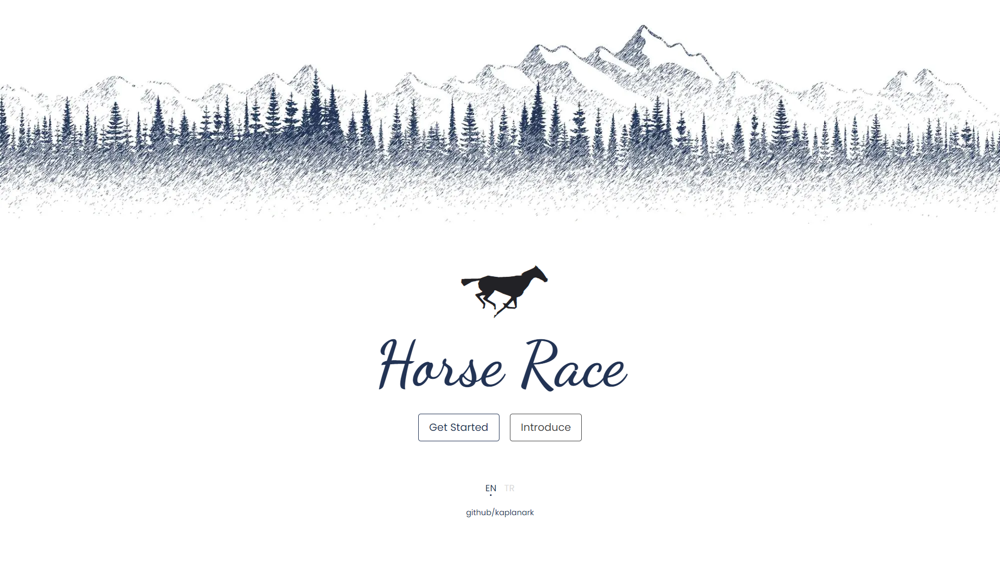

# Horse Race (protein Frontend Bootcamp Final Case)

## Description

<blockquote>This project is a protein & path.dev final case project.</blockquote>

Real-time race of horses running in 8 different lanes on a straight route. After pressing the start button, the countdown is shown and then the horses start from the starting point to the race. During the run, the speeds within a certain range (eg: min 20 km/h, max 40 km/h) are instantaneously changes randomly. The horse with the highest speed win.

to experience <a href="https://horseracing.netlify.app/">DEMO</a>

## Installation

It is a free and open source project. You can download the project from the link below and use it by downloading it to your computer. You can use it for your personal and commercial projects.

Run the following command in your terminal:

```bash
git clone https://github.com/kaplanark/horse-race.git
```

```bash
cd horse-race
```

```bash
npm install
```

```bash
npm run dev
```

## Used Technologies

-  [Vue.js](https://vuejs.org/)
-  [Pinia](https://pinia.vuejs.org/)
-  [Vite](https://vitejs.dev/)
-  [Netlify](https://www.netlify.com/)
-  [Vue Router](https://router.vuejs.org/)
-  [Vitest](https://vitest.dev/)
-  [Vue i18n](https://vue-i18n.intlify.dev/)
-  [HTML](https://developer.mozilla.org/en-US/docs/Web/HTML)
-  [CSS](https://developer.mozilla.org/en-US/docs/Web/CSS)
-  [JavaScript](https://developer.mozilla.org/en-US/docs/Web/JavaScript)

## License

[MIT](https://choosealicense.com/licenses/mit/) This project is licensed under the MIT License - see the LICENSE.md file for details or click the link.

# Project Views


<details>
<summary>Welcome page</summary>

</details>

<details>
<summary>Race track page</summary>

</details>

<details>
<summary>Introduce page</summary>

</details>

<details>
<summary>Not found page</summary>

</details>

## Project Details

-  _Welcome page :_ The welcome page is the first page that the user sees when the project is opened.
-  _Introduce page:_ The introduction page is the page where the user is informed about the project.
-  _Race track page:_ It is the focus page of the project. Functionally, it is the page where the race is shown and controlled.
-  _Not found page:_ It is the page that the user sees when the page they want to access does not exist.

# Components

### BaseButton component props

|   Name   |   Type    |   Default   |                                        Description                                        |
| :------: | :-------: | :---------: | :---------------------------------------------------------------------------------------: |
|   name   | `String`  | _'Button'_  | <sub style="color: #999">It takes the name to be displayed in the button component.</sub> |
| variant  | `String`  | _'primary'_ |   <sub style="color: #999">It takes values ​​such as primary, secondary, ternary.</sub>   |
| disabled | `Boolean` |   _false_   |           <sub style="color: #999">It takes values ​​such as true, false.</sub>           |

### Loader component props

|  Name  |   Type    | Default |                            Description                            |
| :----: | :-------: | :-----: | :---------------------------------------------------------------: |
| status | `Boolean` | _false_ | <sub style="color: #999">It takes the status of the loader.</sub> |

### Lane component props

|  Name   |   Type   | Default |                        Description                        |
| :-----: | :------: | :-----: | :-------------------------------------------------------: |
|  horse  | `Object` |  _{}_   | <sub style="color: #999">It takes the horse object.</sub> |
| lane-no | `Number` |   _0_   | <sub style="color: #999">It takes the lane number.</sub>  |

### Marker component props

|   Name   |   Type   | Default |                             Description                             |
| :------: | :------: | :-----: | :-----------------------------------------------------------------: |
| position | `String` | _left_  | <sub style="color: #999">It takes the position of the marker.</sub> |
|   text   | `String` |  _''_   |   <sub style="color: #999">It takes the text of the marker.</sub>   |
|  count   | `Number` |  _''_   |  <sub style="color: #999">It takes the count of the marker.</sub>   |

### Timer component props

| Name |   Type   | Default |                          Description                           |
| :--: | :------: | :-----: | :------------------------------------------------------------: |
| time | `Number` |   _0_   | <sub style="color: #999">It takes the time of the timer.</sub> |

### SettingsDraver component props

| Name |   Type    | Default |                                Description                                 |
| :--: | :-------: | :-----: | :------------------------------------------------------------------------: |
| open | `Boolean` |   _0_   | <sub style="color: #999">It takes the status of the settings drawer.</sub> |

### ColorPicker component props

| Name  |   Type   | Default |                                               Description                                                |
| :---: | :------: | :-----: | :------------------------------------------------------------------------------------------------------: |
| name  | `String` |  _''_   |                  <sub style="color: #999">It takes the name of the color picker.</sub>                   |
| value | `String` |   _0_   | <sub style="color: #999">It takes the color of the color picker. Emited when the color is changed.</sub> |

### BaseSelect component props

|    Name     |   Type   | Default |                                          Description                                          |
| :---------: | :------: | :-----: | :-------------------------------------------------------------------------------------------: |
|    name     | `String` |  _''_   |             <sub style="color: #999">It takes the name of the color picker.</sub>             |
|    value    | `String` |  _''_   | <sub style="color: #999">It takes the color of the color picker. Emited selected value.</sub> |
|   options   | `Array`  |  _[]_   |              <sub style="color: #999">It takes the options of the select.</sub>               |
| placeholder | `String` |  _''_   |            <sub style="color: #999">It takes the placeholder of the select.</sub>             |

### Alert component props

|  Name   |   Type   |  Default  |                               Description                                |
| :-----: | :------: | :-------: | :----------------------------------------------------------------------: |
| variant | `String` | _default_ |    <sub style="color: #999">It takes the variant of the alert.</sub>     |
| message | `String` |   _''_    |    <sub style="color: #999">It takes the message of the alert.</sub>     |
|  index  | `Number` |  _null_   | <sub style="color: #999">It takes the index of the alert. Required</sub> |

### Alert Provider component props

|   Name   |   Type   |   Default   |                            Description                             |
| :------: | :------: | :---------: | :----------------------------------------------------------------: |
| position | `String` | _top-right_ | <sub style="color: #999">It takes the position of the alert.</sub> |

## Contributing

Pull requests are welcome. For major changes, please open an issue first to discuss what you would like to change.Please make sure to update tests as appropriate. Issues are also welcome for any questions or suggestions.

Some great plugins to use to improve your development experience:

-  [Volar](https://marketplace.visualstudio.com/items?itemName=johnsoncodehk.volar) - Vue 3 IntelliSense
-  [ESLint](https://marketplace.visualstudio.com/items?itemName=dbaeumer.vscode-eslint) - Integrates ESLint JavaScript into VS Code.
-  [Prettier](https://marketplace.visualstudio.com/items?itemName=esbenp.prettier-vscode) - Code formatter using prettier
-  [EditorConfig](https://marketplace.visualstudio.com/items?itemName=EditorConfig.EditorConfig) - EditorConfig for VS Code
-  [Auto Rename Tag](https://marketplace.visualstudio.com/items?itemName=formulahendry.auto-rename-tag) - Automatically rename paired HTML/XML tag
